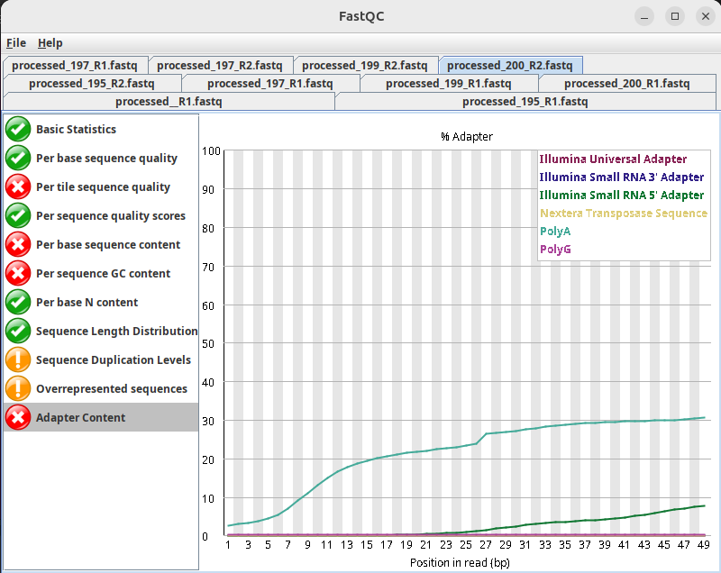
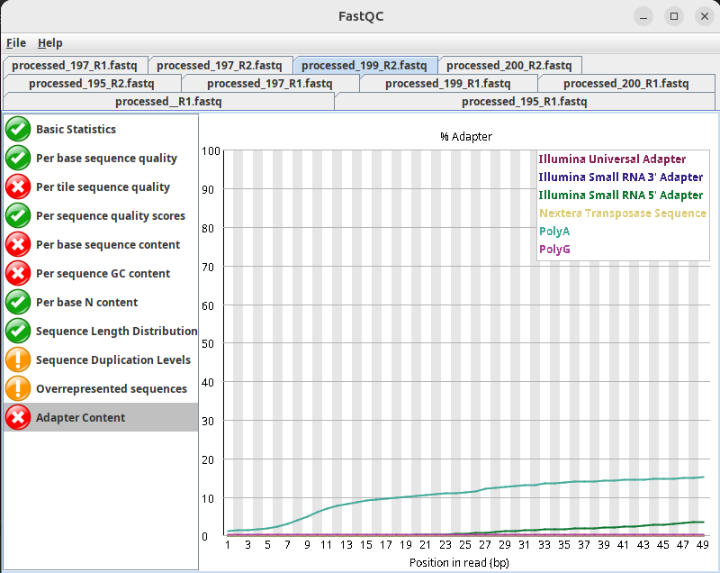
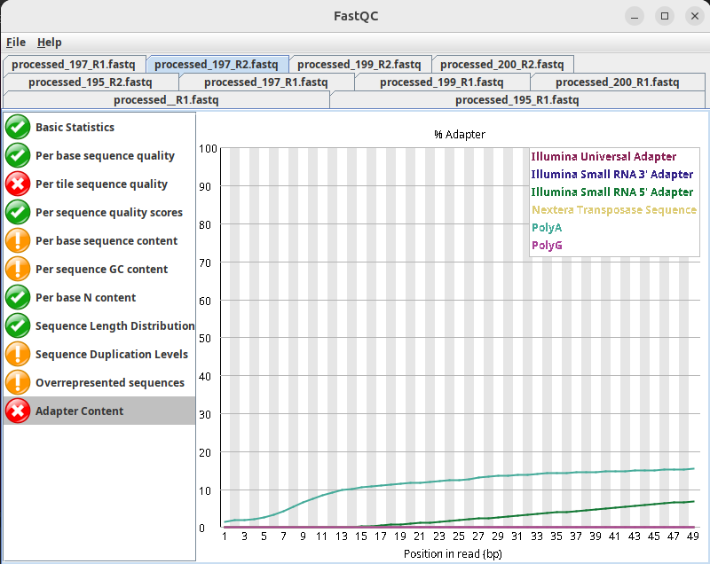
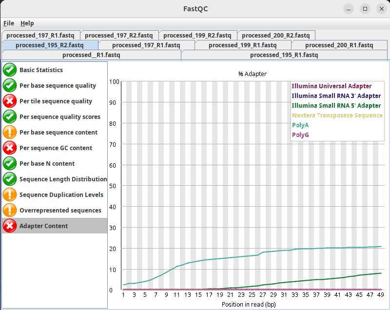
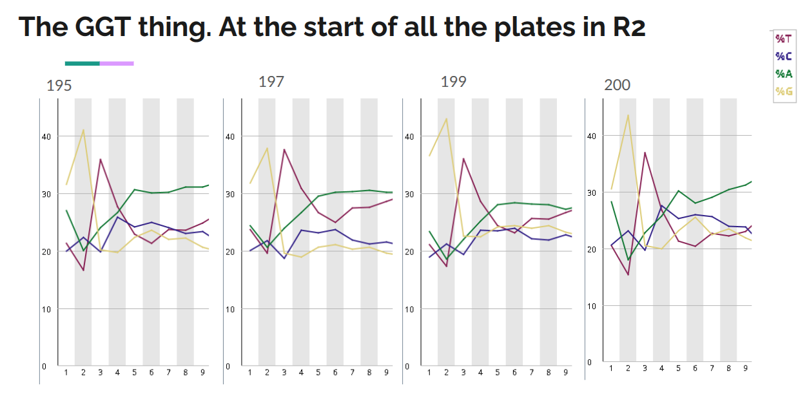

# General
## entry 1: initialized git 06/03/25
### I made a github
### Linked VSCode and github
### Set up automated labjournal structure
This file for notes, commits to github to keep track of code (In the Blame online) or repo changes, and as a backup of my code.  
Looked into how snakemake works. Something to check out later: https://www.youtube.com/watch?v=r9PWnEmz_tc (An introduction to Snakemake tutorial for beginners (CC248))  
set up general_git_auto_commit.sh to commit everything relevant to github with automated annotations.  
set up specific_git_auto_commit.sh to commit specific file with more detailed commit message to document.  
Ready to write and run first script tomorrow.  
REMEMBER: put two spaces after a text line to actually have the next one start on a new line  
# Preprocessing
# UMI-tools extract
### Background on the shell command

#### The command looks like this:
umi_tools extract --extract-method=string \
  --bc-pattern=[PATTERN] \
  --bc-pattern2=[PATTERN] \
  --read2-in=[FASTQIN] \
  --read2-out=[FASTQOUT] \
  -L extract.log [OPTIONS]

#### Table 1: Explanation of Each Flag and Its Input
| Flag                     | Required?          | Description                                                   | What You Should Provide |
|--------------------------|-------------------|---------------------------------------------------------------|-------------------------|
| `--extract-method=string` | Yes               | Specifies that barcodes should be extracted based on a string pattern. | Always use `string` unless you're using regex (`regex`) |
| `--bc-pattern=[PATTERN]`  | Yes               | Defines the barcode pattern in Read 1 (R1).                   | e.g., `CCCCCCCCCCCCNNNNNNNN` where `C` is a cell barcode, `N` is a UMI |
| `--bc-pattern2=[PATTERN]` | No                | Defines the barcode pattern in Read 2 (R2) (only for paired-end). | Use this if R2 also has a barcode/UMI |
| `--read2-in=[FASTQIN]`    | Yes (for paired-end) | Input FASTQ file for Read 2 (R2) (if paired-end).             | Path to your R2 FASTQ file |
| `--read2-out=[FASTQOUT]`  | Yes (for paired-end) | Output FASTQ file for Read 2 (R2) after barcode removal.      | Path to save modified R2 |
| `-L extract.log`          | No                | Writes a log file for tracking extracted barcodes.            | Path to a log file (optional but recommended) |
| `[OPTIONS]`               | No                | Additional parameters like `--whitelist=barcodes.txt` or `--filter-cell-barcode`. | Add if you have a barcode whitelist |

#### Read 1 (R1) Structure: 5' → 3'
| 1  | 2  | 3  | 4  | 5  | 6  | 7  | 8  | 9  | 10 | 11 | 12 | 13 | 14 | 15 | 16 | 17 | 18 | 19 | 20 | 21 | 22 |
|----|----|----|----|----|----|----|----|----|----|----|----|----|----|----|----|----|----|----|----|----|----|
| UMI | UMI | UMI | UMI | UMI | UMI | BC | BC | BC | BC | BC | BC | BC | BC | T | T | T | T | T | T | T | T |

Where: UMI = UMI  
BC: Cell barcode  
T: Poly-T  
### Command runs
#### Command try 1: all plates
umi_tools extract --extract-method=string \
  --bc-pattern=NNNNNNNNNNNNNN \
  --read2-in=[FASTQIN] \
  --read2-out=[FASTQOUT] \

assume that it goes from 5' to 3'.
leave out --bc-pattern2=[PATTERN] because the R2 read does not contain any barcode/UMI information.
--bc-pattern=NNNNNNNNNNNNNN tells umi_tools the structure of the UMI and Barcode bit (6 for the UMI + 8 for the cell barcode)
I ran UMI-tools extract (07/03/2025 version)  
ran out of space, resolved it by deleting old fastq copies of the data that I used for the VASAseq pipeline verification run. Freed up a couple hundred GB.  
It went up until halfway R1 from plate 200, so I deleted the files it made for that plate and ran the script again for only plate 200.
Did not include additional options parameters  
Exctraction seems succesful, appended UMI's to the headers. But also the barcodes. Checked the files and manual to see what went wrong.  

This did not work because I had only N's in my bc_pattern flag. Adjust for next according to:  
N = UMI position (required)  
C = cell barcode position (optional)  
X = sample position (optional)  

From the UMI-tools manual on their website

#### Command try 2: all plates
umi_tools extract --extract-method=string \
  --bc-pattern=NNNNNNCCCCCCCC \
  --read2-in=[FASTQIN] \
  --read2-out=[FASTQOUT] \

assume that it goes from 5' to 3'.
leave out --bc-pattern2=[PATTERN] because the R2 read does not contain any barcode/UMI information.
--bc-pattern=NNNNNNCCCCCCCC tells umi_tools the structure of the UMI and Barcode bit (first the 6 N's for the UMI + 8 C's for the cell barcode)

Adjusted UMI-tools_extract accordingly and ran again.
It worked! :)

#### Command try 3: included barcode whitelist. 
Also made separate directory for the file storage, and had the logs be written to .txt files.
The percentages of reads lost due to not matching a barcode on the whitelist:

##### plate 195
Reads:	63189858  
output:	53697329  
Cell barcode:	9492529  
percentage filtered out due to barcodes not meeting criteria	15.0222350555053

##### plate 197
Reads:	88588094  
output:	71326710  
Cell barcode:	17261384  
percentage filtered out due to barcodes not meeting criteria	19.4849930962506

##### plate 199
Reads:	57971026  
output:	51246830  
Cell barcode:	6724196  
percentage filtered out due to barcodes not meeting criteria	11.5992357975517

##### plate 200
Reads:	62501738  
output:	55808810  
Cell barcode:	6692928  
percentage filtered out due to barcodes not meeting criteria	10.7083870211737

# Adapter trimming
## Try 1: cutadapt adapter trimming
### Background on the shell command
#### Information
Cutadapt finds and removes adapter sequences, primers, poly-A tails and other types of unwanted sequence from your high-throughput sequencing reads. Cutadapt can also demultiplex your reads (according to their website).
Will not do demultiplexing here because MirMaster will do that as well
Do want to detect cell barcodes. Otherwise ask Tsai Ying about them. 
Figured out the read structure!

#### Entire Read structure
| 5' Read (Forward Strand) | AATGATACGGCGACCACCGAGATCTACAC | GTTCAGAGTTCTACAGTCCGACGATC | NNNNNN | NNNNNNNN | (T)₂₄ | XXX...XXX | TGGAATTCTCGGGTGCCAAGGAACTCCAGTCAC | NNNNNN | ATCTCGTATGCCGTCTTCTGCTTG |
|--------------------------|--------------------------------|----------------------------|--------|----------|------|-----------|----------------------------------|--------|--------------------------|
| 3' Read (Reverse Strand) | TTACTATGCCGCTGGTGGCTCTAGATGTG | CAAGTCTCAAGATGTCAGGCTGCTAG | NNNNNN | NNNNNNNN | (A)₂₄ | XXX...XXX | ACCTTAAGAGCCCACGGTTCC TTGAGGTCAGTG | NNNNNN | TAGAGCATACGGCAGAAGACGAAC |
| **Component**            | Illumina P5                    | RA5                        | 6bp UMI | 8bp CB   | tail | cDNA      | RA3                              | 6bp index | Illumina P7              |

#### Command try 1 (fail)
cutadapt on the P5 and P7 adapter sequences, on the raw .fastq reads, looks like this:

cutadapt -a TGGAATTCTCGGGTGCCAAGGAACTCCAGTCAC -A GTTCAGAGTTCTACAGTCCGACGATC -o "$output_r1" -p "$output_r2" "$r1" "$r2"

in the cutadapt_trimming.sh script

UPDATE: this is not useful I will not do it on the final reads.
#### Approach 2:
Use cutadapt to cut the PolyA, and further to the 3' side, complex from the R2 reads. In case they are too short, this will happen. 

##### FASTQC plots on adapter and poly(A) contamination in R2 reads
 
 
 
 

This is why I propose to trim the following sequence:
TTACTATGCCGCTGGTGGCTCTAGATGTGCAAGTCTCAAGATGTCAGGCTGCTAGNNNNNNNNNNNNAAAAAAAAAAAAAAAAAAAAAAAA

just need to figure out if this is indeed how the UMI/BC sequence would work/be smart. I could also input all the (REVERSE COMPLEMENTS OF THE!) barcodes I have, in this sequence, and then only have the 6bp UMI unknown. Or maybe just specify for the 3' end.
OK I looked into it and yest I think this would work:

cutadapt -a TTACTATGCCGCTGGTGGCTCTAGATGTGCAAGTCTCAAGATGTCAGGCTGCTAGNNNNNNNNNNNNAAAAAAAAAAAAAAAAAAAAAAAA -o trimmed.fastq input.fastq
the small a flag specifies that it concerns a 3' adapter
maybe also add the -e 0.05 flag to allow up to 5% mismatches 
and the -O 5 to require at least 5 bp overlap

Unfotunately it didn't work. So I decided to consult the code used in the VASAseq paper analysis by Salmen et al. They used the following command:

```bash
if [ $# -ne 4 ]
then
    echo "Please, give (1) input fastq file; (2) output directory; (3) path2trimgalore; (4) path2cutadapt;"
  exit
fi

file2trim=$1
outdir=$2
path2trimgalore=$3
path2cutadapt=$4

# trim adaptors
${path2trimgalore}/trim_galore --path_to_cutadapt ${path2cutadapt}/cutadapt ${file2trim} -o ${outdir}
mv ${file2trim}_trimming_report.txt ${file2trim%.fastq.gz}_trimming_report.txt

# trim homopolymers
${path2cutadapt}/cutadapt -m 15 --trim-n -a "polyG1=GG{5}" -a "polyC1=CC{5}" -a "polyT1=TT{5}" -a "polyA1=AA{5}" -o ${file2trim%.fastq.gz}_trimmed_homoATCG.fq.gz  ${file2trim%.fastq.gz}_trimmed.fq.gz

exit
```
So, trimgalore to detect and trim the adapters, and cutadapt to trim the poly(A), and other poly(N) tails using yet another version of a poly(A) removal command.

## try 2: Trimgalore + cutadapt
I ended up with my own version of this. It didn't make sense to me to trim all the poly(N)'s given our read structure and the fact that we don't detect them in the FASTQC plots. I did try also trimming all of them before only the A tails, but it did not make a noticeable difference on the adapter content plots so I ended up just going with the only poly(A) one.

### My trimgalore script for adapter detection + trimming
```bash
for platenr in 195 197 199 200
do
    in_loc="/home/lulunots/Documents/1_ncRNA/3_fastq/UMI-tools_extract_${platenr}"
    out_loc="/home/lulunots/Documents/1_ncRNA/3_fastq/trimgalore"
    mkdir -p "${out_loc}"

    # Define the file to process (assuming one file per platenr)
    r2="${in_loc}/processed_${platenr}_R2.fastq"
    output_r2="${out_loc}/cutadapt_${platenr}_R2_cutfive_reverse_control.fastq"

    echo "Running trimgalore on R2 file: $r2"

    trim_galore --path_to_cutadapt /home/lulunots/anaconda3/bin/cutadapt --output_dir "$output_r2" "$r2"

    echo "Finished trimming R2 file: $r2"
done
```

### My cutadapt script for poly(A) trimming
```bash
for platenr in 195 197 199 200
do
    in_loc="/home/lulunots/Documents/1_ncRNA/3_fastq/trimgalore/cutadapt_${platenr}_R2_cutfive_reverse_control.fastq"
    out_loc="/home/lulunots/Documents/1_ncRNA/3_fastq/PolyA_trimmed"
    mkdir -p "${out_loc}"

    # Define the file to process (assuming one file per platenr)
    r2="${in_loc}/processed_${platenr}_R2_trimmed.fq"
    output_r2="${out_loc}/PolyA_trimmed_${platenr}_R2"

    echo "Running cutadapt on R2 file: $r2"

    cutadapt -m 15 --trim-n -a "polyA1=AA{5}" -o "${output_r2}.fastq" "$r2" > "${output_r2}.log" 2>&1

    echo "Finished trimming R2 file: $r2"
done
```
## The GGT thing
I observed that all the R2 sequences had a significant GGT pattern at the start:


This could be the GGT top strand RA3 adapter. The GGT is the last sequence there. To check this:
Try trimming the 5'-3' TGG starting adapter from the top strand on the R2 reads. Like you would if it would have been switched from strand. See if we can detect it. So from the 5' end as well

        cutadapt -A TGGAATTCTCGGGTGCCAAGGAACTCCAGTCAC \
          -o "$output_r2" "$r2" -e 0.05

accidentally ran as a 3' adapter (-a), but it is supposed to be a 5' (-g). Changed to this:

        cutadapt -g TGGAATTCTCGGGTGCCAAGGAACTCCAGTCAC \
          -o "$output_r2" "$r2" -e 0.05 > "${out_loc}"/cutadapt_${platenr}_R2_cutfive.log 2>&1 

now try again with the reverse: CACTGACCTCAAGGAACCGTGGGCTCTTAAGGT

        cutadapt -g CACTGACCTCAAGGAACCGTGGGCTCTTAAGGT \
          -o "$output_r2" "$r2" -e 0.05 > "${out_loc}"/cutadapt_${platenr}_R2_cutfive_reverse.log 2>&1 

This gave around 6-7% trimming!
To check whether it's not just confirmation bias, run the following. To check for how many reads have GGT at the end. Since we have three overlap with the full adapter as well as minimum. If this is the same (or higher) percentage, the previous finding does not mean much, it just confirms what we already knew. 

        cutadapt -g ^GGT \
          -o "$output_r2" "$r2" -e 0.05 > "${out_loc}"/cutadapt_${platenr}_R2_cutfive_reverse_control.log 2>&1 

# Ribo Depletion
## trial one: sortmerna run
tried this command:
```bash
  REF_PATH="/home/lulunots/Documents/1_ncRNA/4_datafiles/SortMeRNA_database_files/smr_v4.3_default_db.fasta"

  for platenr in 195 197 199 200
  do
      READS_PATH="/home/lulunots/Documents/1_ncRNA/3_fastq/PolyA_trimmed/PolyA_trimmed_${platenr}_R2" 

      echo "Running sortmerna on R2 file: "${READS_PATH}.fastq""
      sortmerna --ref "$REF_PATH" --reads "${READS_PATH}.fastq" > "${READS_PATH}_ribo.log" 2>&1
      echo "Finished ribo depletion on R2 file: "${READS_PATH}.fastq""
  done
```
took over an hour to run. I think more even.

This only produced a BLAST file, aligned.blast. Not the .fastq that I wanted.

## trial two: sortmerna run
try this:
```
sortmerna \
  --ref /home/lulunots/Documents/1_ncRNA/4_datafiles/SortMeRNA_database_files/smr_v4.3_default_db.fasta \
  --reads /home/lulunots/Documents/1_ncRNA/3_fastq/PolyA_trimmed/PolyA_trimmed_195_R2.fastq \
  --workdir /home/lulunots/Documents/MEP/RiboDepletion \
  --fastx --other
```
explanation:
--fastx → Saves rRNA and non-rRNA reads in FASTQ format.
--other → Keeps both rRNA and non-rRNA reads.
--workdir /home/lulunots/sortmerna_output → Saves files in a clear location.

### this was my original plan:
REF_PATH="/home/lulunots/Documents/1_ncRNA/4_datafiles/SortMeRNA_database_files/smr_v4.3_default_db.fasta"
THREADS=10

for platenr in 195 197 199 200
do
    READS_PATH="/home/lulunots/Documents/1_ncRNA/3_fastq/PolyA_trimmed/PolyA_trimmed_${platenr}_R2" 

    echo "Running sortmerna on R2 file: "${READS_PATH}.fastq""
    
    
    sortmerna --ref "$REF_PATH" --reads "${READS_PATH}.fastq" --workdir /home/lulunots/Documents/MEP/RiboDepletion --fastx --other -a $THREADS > "${READS_PATH}_ribo.log" 2>&1
    echo "Finished ribo depletion on R2 file: "${READS_PATH}.fastq""
done

### but I changed it to this to be able to use my cores more efficiently
```bash
REF_PATH="/home/lulunots/Documents/1_ncRNA/4_datafiles/SortMeRNA_database_files/smr_v4.3_default_db.fasta"
THREADS=4  # Adjust this based on your CPU

for platenr in 195 197 199 200; do
    READS_PATH="/home/lulunots/Documents/1_ncRNA/3_fastq/PolyA_trimmed/PolyA_trimmed_${platenr}_R2"
    WORKDIR="/home/lulunots/Documents/MEP/RiboDepletion/${platenr}"

    # Create work directory if it doesn't exist
    mkdir -p "$WORKDIR"

    echo "Running sortmerna on R2 file: ${READS_PATH}.fastq"

    sortmerna --ref "$REF_PATH" \
              --reads "${READS_PATH}.fastq" \
              --workdir "$WORKDIR" \
              --fastx --other \
              -a $THREADS \
              > "${READS_PATH}_ribo.log" 2>&1 &

    echo "Started ribo depletion on ${READS_PATH}.fastq in background."
done

wait  # Ensure all jobs complete before exiting
echo "All sortmerna jobs finished."
```

To optimize I take a multithreading approach. The specs of my PC are:
Cores: 14 (physical)
Threads: 20 (logical)
Threads per core: 2 (meaning some cores are hyper-threaded, but not all)
Max clock speed: 4.8 GHz
L3 Cache: 24 MB

So I have 20 threads total, and as a rule of thumb you should use 75–90% of total threads to balance performance and system stability.
So I can run 15-18 threads across all jobs.
I have 4 jobs running in parallel, so I if I run each one with 4 threads, so 16 total it should use my resources optimally without overloading.

### this gave an error: sortmerna: ./src/sortmerna/kvdb.cpp:52: KeyValueDatabase::KeyValueDatabase(const std::string&): Assertion `s.ok()' failed.
```bash
REF_PATH="/home/lulunots/Documents/1_ncRNA/4_datafiles/SortMeRNA_database_files/smr_v4.3_default_db.fasta"
THREADS=2  # Adjust this based on your CPU

for platenr in 195 197 199 200; do
    READS_PATH="/home/lulunots/Documents/1_ncRNA/3_fastq/PolyA_trimmed/PolyA_trimmed_${platenr}_R2"
    WORKDIR="/home/lulunots/Documents/MEP/Preprocessing/RiboDepletion/${platenr}"

    # Create work directory if it doesn't exist
    mkdir -p "$WORKDIR"

    echo "$(date): Started ribo depletion on ${READS_PATH}.fastq" >> "$WORKDIR"/run_log.txt

    sortmerna --ref "$REF_PATH" \
              --reads "${READS_PATH}.fastq" \
              --workdir "$WORKDIR" \
              --fastx --other \
              -a $THREADS \
              > "${READS_PATH}_ribo.log" 2>&1 &

    echo "Started ribo depletion on ${READS_PATH}.fastq in background."
done

wait  # Ensure all jobs complete before exiting
echo "All sortmerna jobs finished."
```

### now try: 
```bash
  REF_PATH="/home/lulunots/Documents/1_ncRNA/4_datafiles/SortMeRNA_database_files/smr_v4.3_default_db.fasta"
  THREADS=2  # Adjust this based on your CPU

  for platenr in 195 197 199 200; do
      READS_PATH="/home/lulunots/Documents/1_ncRNA/3_fastq/PolyA_trimmed/PolyA_trimmed_${platenr}_R2"
      WORKDIR="/home/lulunots/Documents/MEP/Preprocessing/RiboDepletion/${platenr}"

      # Create or clean work directory
      rm -rf "$WORKDIR"  # Remove previous run if exists
      mkdir -p "$WORKDIR"

      LOG_FILE="${WORKDIR}/run_log.txt"

      echo "$(date): Started ribo depletion on ${READS_PATH}.fastq" >> "$LOG_FILE"

      sortmerna --ref "$REF_PATH" \
                --reads "${READS_PATH}.fastq" \
                --workdir "$WORKDIR" \
                --fastx --other \
                --threads $THREADS \
                > "${WORKDIR}/sortmerna.log" 2>&1

      echo "$(date): Finished ribo depletion on ${READS_PATH}.fastq" >> "$LOG_FILE"
      echo "Finished ribo depletion on ${READS_PATH}.fastq"
  done

  echo "$(date): All sortmerna jobs finished." | tee -a "$LOG_FILE"
```
Removed & → Now sortmerna runs one at a time, preventing overload issues.
Added completion log for each file → Helps track which ones finished.
Keeps logs clean & in the work directory.

# Demultiplexing and regrouping
I used a custom python script for demultiplexing.

It takes the CB whitelist, and a fastq files as input. You also need to specify an output location.  
It really just demultiplexes the fastq reads that have the UMI and CB in the header in the standard UMI-tools extract format and then put the reads with a specific barcode in a separate .fastq file for every barcode. In our case the barcodes corresponds to specific cells/wells. The script also writes a little report. This was demultiplex.py

Then I used a script to rename all the demultiplexed cells to contain not just their well number/indentifier but also their plate because I had forgotten to include that before: rename.sh

Finally, I merged the fastq's corresponding to control, and the ones corresponding to CIN into two .fastq files per plate.

# MirMaster
## Run: all control
custom sequencing kit
this adapter: CAAGTCTCAAGATGTCAGGCTGCTAG
The RA5 3' one. Because I think it is most likely to be present in the reads (though it really shouldnt be)

NTS: todo: incorporate better naming convention in demultiplexing that contains the plate nr

## Submitted two runs:  
  all control pooled together, but input separately in well specific fastq's with ID: https://ccb-compute.cs.uni-saarland.de/mirmaster2/results/run_2cbvlhz9  
  all lagging pooled together, but input separately in well specific fastq's with ID: https://ccb-compute.cs.uni-saarland.de/mirmaster2/results/run_vt2br7_o  

This failed, I think because there was not enough info in some of the separate .fastq files to be analyzed, so their analysis failed, and then so did the overall run.

## new runs:  
I input two new runs where the .fastqs of all the control/CIN wells were merged together per plate. There is one containing the control of all the plates, and one containing the CIN.  

https://ccb-compute.cs.uni-saarland.de/mirmaster2/results/run_vzkf5005  
https://ccb-compute.cs.uni-saarland.de/mirmaster2/results/run_wgfxa1u7  

These gave results!  
https://ccb-compute.cs.uni-saarland.de/mirmaster2/results/run_aacbogiw failed  

New run after the email thing which should have fixed the mirmaster server:  
https://ccb-compute.cs.uni-saarland.de/mirmaster2/results/run_kqda0qqj  

with annotations, ALL plates:  
https://ccb-compute.cs.uni-saarland.de/mirmaster2/results/run_rs7zo7z8  

## changed approach
goal: randomly split up all patient samples into three subgroups per sample  

first merged all samples by:  

patient, lagging or control  
  
then:  

used seqtk to randomly suffle the fastq's  
then split them up evenly into three parts  

now run them from the windows pc because linux will not let me add annotation files.  


# Snakemake
Have been working on making a snakefile to run the pipeline. Have added the preprocessing scripts so far, and the demultiplexing one.   
Fine tuned the demultiplexing python script to be more efficient, robust, and clear, albeit a bit more complicated maybe.  

### conda environment
Need to remember to also provide a conda enviroment along with it. Do using an environment.yaml. Then provide instructions to run:  

```bash
  conda env create -f environment.yml
  conda activate rnaseq_pipeline
```
Up until the demultiplexing step it should contain at least:

```yaml
name: rnaseq_pipeline
channels:
  - bioconda
  - conda-forge
  - defaults
dependencies:
  - python>=3.8
  - snakemake>=7.0
  - umi_tools
  - trim-galore
  - cutadapt
  - sortmerna
```

And then you can run:  
 ```bash
 snakemake \
  --use-conda \
  --cores 8 \
  --config threads=8 \
  --rerun-incomplete \
  --printshellcmds \
  --latency-wait 30
```

where (this was written by ChatGPT):  

```
--latency-wait <seconds>  
After a job finishes, Snakemake checks that all its declared output files really exist before moving on. On some filesystems—especially network mounts (NFS, Lustre, etc.) or cloud‐backed disks—there can be a short delay between a process writing a file and that file becoming visible to other processes. If Snakemake doesn’t immediately see an expected output, it will normally error out.
The --latency-wait 30 flag tells Snakemake: “If you don’t see a newly created output file right away, wait up to 30 seconds for it to appear before giving up.” This prevents spurious “missing file” errors on slow or laggy file systems.

--rerun-incomplete  
When a Snakemake job starts, it creates its output files as it goes. If you interrupt a run (Ctrl+C, cluster preemption, hardware issue, etc.), you may end up with half-written files in your working folders. By default, Snakemake assumes that if an output file exists, that rule is done.
With --rerun-incomplete, Snakemake inspects each target it wants to build and any of its intermediate files: if it finds an output file whose rule is not marked as successfully completed (i.e., there’s no record in the .snakemake work directory indicating that rule finished), it will delete or ignore the partial file and re‐execute the rule. This ensures you don’t end up with corrupt or half-written outputs after an interrupted run.
```

### dynamic threads
built in that threads are dynamically added into the snakefile using an input flag instead of hardcoded into the file. Can now run:
```bash
snakemake --cores 8 --config threads=THREAD_NO
```  
Snakefile that includes that: Snakefiles/Snakefile_demux_threads

## mini README concept:
### Directory layout
```text
project-root/
├── Snakefile           # Snakemake workflow (placed here)
├── config.yaml         # Configuration file (must be named explicitly in the command)
├── raw_fastq/          # raw_dir: contains your FASTQ samples
│    └── ${sample_dir_pattern}/
│         ├── ${sample_pattern_r1}
│         └── ${sample_pattern_r2}
├── data/               # data_dir:
│    ├── datafiles/     # cb_whitelist, ref_rRNA
│    │    └── SortMeRNA_database_files/
│    └── intermediate/  # Snakemake temp outputs
├── scripts/            # scripts_dir: demultiplex.py
└── results/            # results_dir: final outputs (ribo_depletion, demultiplexed)
```

NB: By default, raw_dir points to a raw_fastq/ folder in your project directory. If your raw data resides elsewhere (e.g. one level up), you can specify an absolute or relative path in config.yaml

### Usage
1. Edit config.yaml to point raw_dir and data_dir, and adjust patterns if needed.  

2. From the project-root, you have several options for running the pipeline:
```shell
# Dry-run (no execution, useful for debugging)
snakemake --cores 1 --configfile config.yaml --dry-run --printshellcmds

# Run the workflow with N cores
snakemake --cores N --configfile config.yaml

# If using conda environments defined per rule
snakemake --cores N --configfile config.yaml --use-conda
```

Ensure Snakefile and config.yaml are both in your project-root directory.
# circRNA
Needed a new conda environment to run CIRIquant because it needs different version of python than I have in my base environment. So I did this, as is recommended according to the ciriquant manual:

```bash
# Download packed package
wget https://github.com/bioinfo-biols/CIRIquant/releases/download/v1.1.3/CIRIquant_v1.1.3.tar.gz
mkdir -p CIRIquant_env
tar zxvf CIRIquant_v1.1.3.tar.gz -C CIRIquant_env

# Configuration environments (required)
conda activate ./CIRIquant_env
cd CIRIquant_env
make
```


# Experiment Title
## Experiment 1: Analyzing Data
### Procedure

just plain text  
and more text